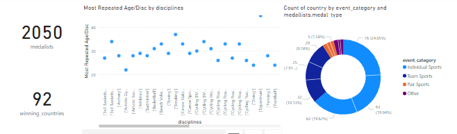

# 🏅 Olympics Dashboard – Paris 2024  

## 📌 Project Overview  
This project is a **Power BI interactive dashboard** built using data from the **Paris 2024 Olympics**.  
The goal of this project is to provide clear insights into athlete performance, medal distribution, and event trends through **data integration, cleaning, and visualization**.  

## ✨ Key Features  
- Integrated and cleaned multiple datasets from the Paris 2024 Olympics.  
- Designed **10+ visualizations** including medal tallies, athlete statistics, and event analysis.  
- Used **DAX measures** and slicers to create dynamic, interactive insights.  
- Delivered a dashboard that supports **data-driven decision making** for sports analysis.  

## 🛠️ Tools & Technologies  
- **Power BI Desktop** – dashboard creation and visualization  
- **DAX** – for calculated measures  
- **Data Cleaning & Integration** – pre-processing raw Olympic data  

## 📊 Dashboard Preview  
  

## 🚀 How to Access  
1. Download the `.pbix` file from this repository:  
   👉 [OlympicsDashboard.pbix](./DV-project.pbix)  
2. Explore the dashboard interactively.  
